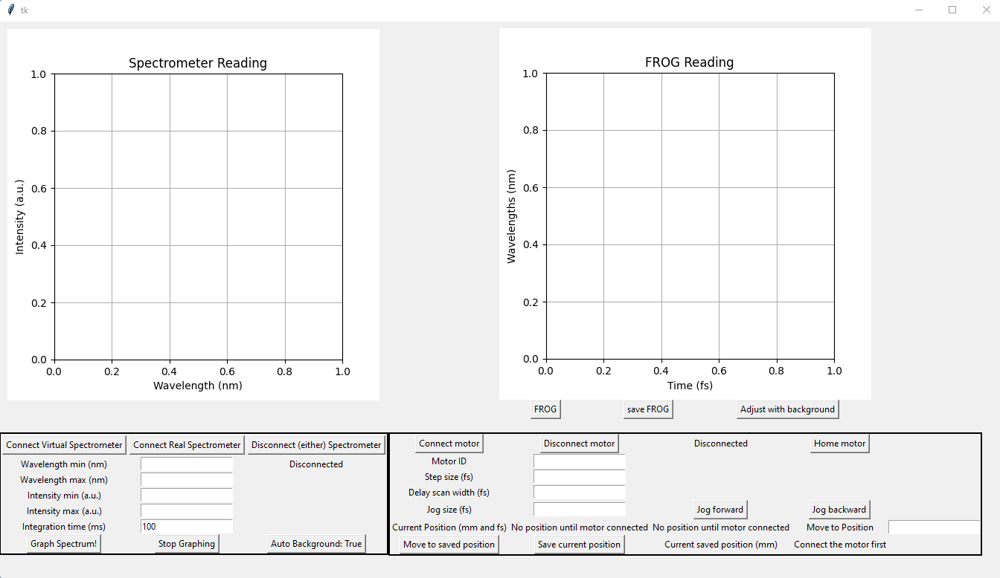
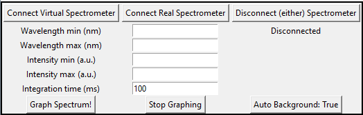
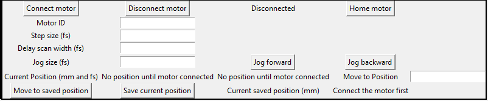
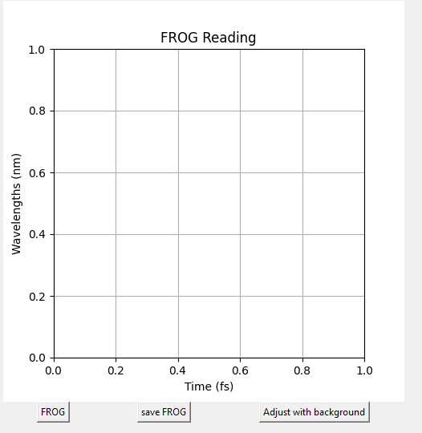
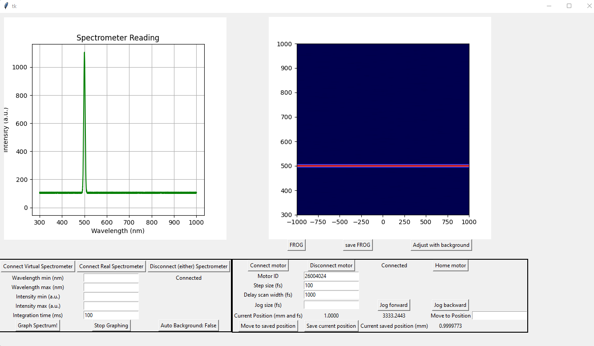

# FROG_
Creating an API for spectrometer and motor controller
**Currently only compatible with Windows OS**

# How to use
* Ensure all libraries and files necessary are downloaded (listed [below](https://github.com/gsgolba/FROG_2.0/blob/main/README.md#necessary-downloads))
* Run the program either by launching the executible (in dist folder) or running the "FROG_GUI_2.0.py" script. Should display an interface as below

## Spectrometer Controls
* Connecting/Disconnecting to a real or virtual spectrometer
  * The virtual spectrometer will output a spectrum sharply peaked at 500 nm
  * The program will attempt to connect to the first OceanOptics spectrometer it sees connected to the computer when prompted by the user
    * Does not allow for the user to choose which real spectrometer it will connect to (yet)
* Change the wavelength range that will be outputted on the graph
  * This also changes the range of data recorded on the FROG
* Change the intensity range that will be outputted on the graph (useful for rescaling)
* Change the integration time
  * Expect lag/slowdown for long integration times (>500 ms) when graphing the spectrum. For this, I recommend briefly graphing the spectrum to ensure the output is what you expect and then stop graphing. When FROGing, the spectrum will be shown and updated at each step anyway.
* Toggle to start and stop graphing the spectrum
* Toggle to automatically subtract the background from the spectrometer reading or display the raw spectrometer output.
  * This will also affect the data collected when FROGing
* Anytime the user attempts to connect a spectrometer or change the integration time, a pop-up will appear to ask the user to block the beam for the program to collect a new background measurement

## Motor Controls
* Connecting/Disconnecting to a ThorLabs motor
  * In order to successfully connect, the user must input the motor ID: The serial number on the back of the motor itself
* Homing the motor to find the 0 position (only works with an actuator connected)
* Set the step size for the FROG scan
  * Note the motor itself will move half the distance inputted in order to accoutn for the round trip the laser takes. For example: 100fs step size = 0.03 mm step size = 0.015 mm actual movement on motor
* Set the scan width for the FROG scan
  * same nuance as for step size
* Set jog size and move forward and backward
  * Essentially a way to move the motor a precise discrete amount of the users choosing
* Displayed motor position (in both mm and fs)
* Option to move to a specific position inputted by the user (in mm)
* Move to a saved position/saving a current position
  * Currently only allows for one saved position
* **Avoid pressing the connect motor button a second time after already connecting. Will likely cause an Exception and program willl need to be restarted**

## FROG Controls
* **In order to run a FROG scan the following must be done by user**
  1. Connect a spectrometer
  2. Connect a motor
  3. Set step size and step width
  4. Ensure the step width does not go past the physical range of the motor
     * for example: if the motor is homed and in position 0, no scan width will work for frogging as the motor cannot move any further back to initiate the scan
* FROG with FROG button
  * The motor will move backwards by one full scan width and then begin scanning, moving by the inputted step size. Will finish after moving one full scan width past the original location (time 0) and will return to original location when FROG scan is finished
  * Each step in the scan waits an entire integration length as denoted in the spectrometer controls. This ensures that each step is getting a new spectrum from the spectrometer.
* save the FROG data (will save data in a txt file in the format necessary for the post proocessing program to read)
* Adjust the FROG data with the background intensity
  * Should not be necessary if Auto Background is toggled True in the Spectrometer controls

## Example FROG
* Below is an example FROG using a virtual spectrometer and a KST101 Thorlabs motor. Since the spectrometer is virtual, moving the motor does nothing to the spectrum, hence we get a constant intensity read out in the FROG for all time steps. In this case, the motors original location was at 1 mm (homed) and returned after finishing the FROG scan.

# Necessary Downloads
* Download Thorlabs kinesis software for the DLLS: https://www.thorlabs.com/software_pages/ViewSoftwarePage.cfm?Code=Motion_Control&viewtab=0
  * There is a file called Thorlabs.MotionControl.DotNet_API.chm which is basically the documentation for all the functions that the motor controller software provides
* A couple of Python libraries to import:
  * tkinter
  * seabreeze
    * Note: Installing seeabreeze is a bit tricky on Windows. You'll need to ensure you have Visual Studio and Windows SDK installed then restart computer
  * seatease
  * pythonnet

# Some GOATED githubs:
* [SeaBreeze](https://github.com/ap--/python-seabreeze): Lets you use Ocean Optics spectrometer through python
* [SeaTease](https://github.com/jonathanvanschenck/python-seatease): Simulates Ocean Optics spectrometer to test code without need of physical spectrometer
* [ThorLabs Motor Stepper](https://github.com/rwalle/py_thorlabs_ctrl/blob/master/py_thorlabs_ctrl/kinesis/motor.py): Code to interface with Thorlabs motor via python. Not exactly what I implemented, but helpful reference to functions in the Thorlabs dll.

God speed brother
